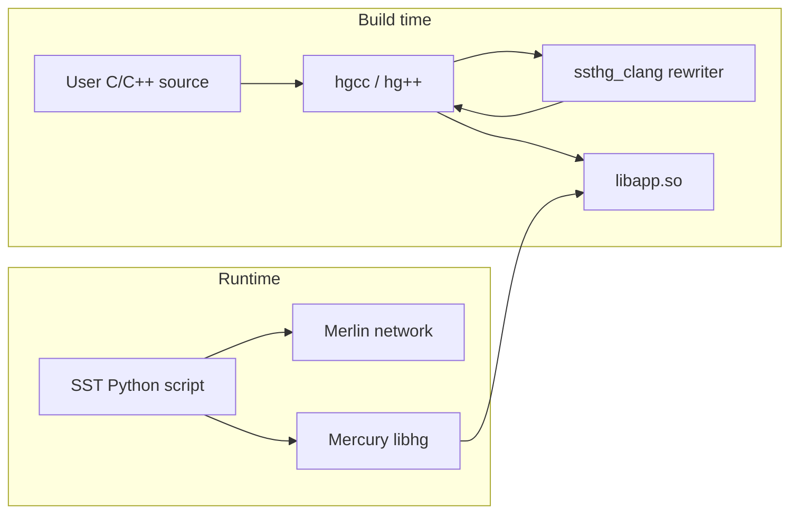

# SST-HGCC

SST-HGCC (HGCC) is Mercury's compile-time toolchain for running HPC applications
inside the [SST](https://sst-simulator.org/) discrete-event simulator. It
provides `hgcc` and `hg++` compiler wrappers plus an LLVM-based source rewriter
(`ssthg_clang`) that transform user C/C++ code into a loadable shared library
(`.so`) executed by the Mercury element in sst-elements.

HGCC is **not** a standalone MPI runtime. You need SST Core, sst-elements (with
the Mercury/HG element), and LLVM/Clang with libTooling to build and use it.

For step-by-step install commands, see [INSTALL.md](INSTALL.md).

## How it works



At build time, `hg++` preprocesses your source, runs `ssthg_clang` to
skeletonize compute and rewrite `main`, then compiles and links a PIC shared
object. At simulation time, an SST Python script configures the network
(Merlin) and operating system (Mercury), which loads your `.so` and runs the
rewritten entry point.

## How code runs under Mercury

When the simulator loads your `.so`, code is **not** running natively the
way it would under `mpirun`. A few things change:

- **`main` is renamed.** `ssthg_clang` renames `main` to
  `sst_hg_user_main_<mangled>` and emits a wrapper Mercury calls once per rank
  inside a single OS process. There is no `mpiexec`; ranks are virtual.
- **MPI is virtual.** `#include <mask_mpi.h>` routes every MPI call through
  sst-elements' `mask_mpi`, which models messages on the simulated Merlin
  network. Real MPI is never linked or invoked.
- **Compute is modeled, not executed.** `ssthg_clang` strips loops and
  expressions by default (skeletonize mode), inserting `ssthg_*` time-advance
  hooks driven by the simulated platform (`frequency`,
  `compute_library_access_width`, `compute_library_loop_overhead`). Values are
  no longer meaningful; **time** is. Use `#pragma sst keep` to preserve real
  computation where you need it.
- **Globals and TLS are privatized.** All ranks live in one address space, so
  the rewriter rewrites globals and thread-locals to per-rank storage. The
  `tests/test_tls.cc` integration test demonstrates this — every rank prints
  `my_global: 1` because each `++my_global` hits a private copy.
- **Time advances via platform params.** Wall-clock latency comes from the
  Merlin/Mercury platform definition (link latency/bandwidth, `post_rdma_delay`,
  `max_eager_msg_size`, etc.), not from the host CPU.

---

## Getting Started

### Prerequisites

Install these in order before building sst-hgcc:

| Component | Notes |
|-----------|-------|
| **SST Core** | Provides `sst-config` on your `PATH` |
| **sst-elements** | Mercury/HG element; build with `--with-std=17` |
| **LLVM 22** | With libTooling (required for `ssthg_clang`) |
| **C/C++ compiler** | Clang recommended (`CC=clang CXX=clang++`) |
| **Autotools** | `autoconf`, `automake`, `libtool` (used by `./autogen.sh`) |

### Build and install

```bash
git clone https://github.com/sstsimulator/sst-hgcc.git
cd sst-hgcc
./autogen.sh
mkdir build && cd build

../configure CC=clang CXX=clang++ \
  --with-std=17 \
  --prefix=$HOME/sst-hgcc/install \
  --with-sst-core=$HOME/sst-core/install \
  --with-sst-elements=$HOME/sst-elements/install \
  --with-clang=$HOME/llvm-project-18.1.8.src/install

make -j$(nproc) && make install
export PATH=$HOME/sst-hgcc/install/bin:$PATH
```

On macOS, also set:

```bash
export SDKROOT=$(xcrun --sdk macosx --show-sdk-path)
export LDFLAGS="-fuse-ld=lld"
```

### Verify the install

```bash
hg++ --version
hg++ --flags          # print Mercury include/link flags added automatically
make check            # lit rewriter tests + test_tls library (optional)
make installcheck     # SST integration test via tests/test_tls (needs sst on PATH)
```

The examples under `examples/` are **not** built by `make`, `make install`, or
`make check`. See [Building the examples](#building-the-examples) below.

### Configure-time options

| Option | Description |
|--------|-------------|
| `--prefix=DIR` | Install root (default `/usr/local`) |
| `--with-sst-core=DIR` | **Required.** SST Core install prefix |
| `--with-sst-elements=DIR` | **Required.** sst-elements install prefix |
| `--with-clang=DIR` | **Required** for rewriter. LLVM install root |
| `--with-std={11,14,17}` | C++ standard for user apps (default 11; 17 recommended) |
| `--enable-use-replacements` | Install extra replacement STL headers |
| `--enable-strict-tests` | Fail configure if lit, FileCheck, or sst missing |
| `--with-python=DIR` | Python install prefix |
| `--with-sdk=PATH` | macOS SDK path (`-isysroot`) |

### `hgcc` / `hg++` command-line flags

| Flag | Description |
|------|-------------|
| `--skeletonize` | Activate skeletonization (strip compute, rewrite `main`; default for app builds) |
| `--memoize` | Activate memoization mode (capture variable types) |
| `--replacements=hdr1,hdr2` | Inject replacement headers (e.g. `pthread.h,vector`) |
| `--disable-mpi` | Skip virtual MPI environment |
| `--app-name=NAME` | Override app registration name (default: derived from `-o` output) |
| `--sst-component` | Skip all source-to-source rewriting (use when building an SST component itself) |
| `--flags` | Print extra flags SST adds automatically |
| `--prefix` | Print the hgcc install prefix |
| `--host-cc`, `--host-cxx` | Override underlying host compilers |
| `-o`, `-c`, `-std`, `-I`, `-L`, `-l`, `-fPIC` | Standard compile/link flags (forwarded) |

### Environment variables

| Variable | Description |
|----------|-------------|
| `SST_HG_VERBOSE=1` | Verbose compiler wrapper output |
| `SST_HG_DELETE_TEMPS=0` | Keep temporary source-to-source files |
| `SST_HG_DELETE_TEMP_SOURCES=0` | Keep rewritten `.cc` intermediates |
| `SST_HG_DELETE_TEMP_OBJECTS=0` | Keep temporary object files |
| `SST_HG_SKELETONIZE` | Enable skeletonization via environment |
| `SST_HG_MEMOIZE` | Enable memoization via environment |
| `SST_HG_DEBUG_SRC2SRC` | Debug the source-to-source pipeline |
| `SST_HG_CXX`, `SST_HG_CC` | Override host C++ / C compilers |
| `SST_HG_PREFIX` | Override hgcc install prefix |
| `SST_HG_CONFIG=1` | Skip certain steps (used by automake/cmake probes) |

### Install layout

After `make install`, key paths under `$prefix` are:

| Path | Contents |
|------|----------|
| `$prefix/bin/` | `hgcc`, `hg++`, `ssthg_clang`, Python driver scripts |
| `$prefix/include/replacements/` | Shadow STL/system/MPI/pthread headers |
| `$prefix/include/memoization/` | Memoization capture headers (C++17) |
| `$prefix/include/hgcc/` | hgcc-specific headers |

---

## Building the examples

The [`examples/`](examples/) directory contains documented Mercury apps and
`#pragma sst` demos. These are **optional** and kept separate from the main
toolchain build so that a normal install stays fast and does not require a full
Mercury/SST stack at compile time.

### What each make target builds

| Target | Builds examples? | Notes |
|--------|------------------|-------|
| `make` | No | Builds `hgcc`, `hg++`, `ssthg_clang`, and wrapper scripts only |
| `make install` | No | Installs the toolchain; does not install example `.so` files |
| `make check` | No | Runs lit rewriter tests; builds `tests/libtest_tls.so` for integration testing |
| `make examples` | **Yes** | Compiles all example sources (see below) |
| `make install-examples` | Installs only | Copies the four runnable example `.so` files to the SST element library path |
| `make run-examples` | **Yes** (if needed) | Runs `make examples`, then executes the four SST-runnable demos |

### What `make examples` produces

From the build directory:

```bash
make examples
```

This compiles:

- **Four runnable shared libraries** — `examples/libmercury_hello.so`,
  `examples/libmercury_hello_pragma.so`, `examples/libcompute_demo.so`,
  `examples/libblocking_demo.so`
- **One compile-only demo** — `examples/pragmas/memoize/demo.o` (built with
  `hg++ --memoize`, shows variable-capture output)

To install the runnable `.so` files where SST/Mercury can find them:

```bash
make install-examples    # installs to SST_ELEMENT_LIBRARY_EXT_LIBDIR
```

To build, install, and run all four SST demos in one step:

```bash
make run-examples        # requires sst on PATH
```

To remove installed example libraries:

```bash
make uninstall-examples
```

You can also compile a single example manually with `hg++` (see the Mercury app
walkthrough below) without using the make targets at all.

---

## Building and Running a Mercury App

This walkthrough uses [`examples/mercury_hello/`](examples/mercury_hello/), a
minimal two-rank MPI program.

### Step 1 — Write the application source

```cpp
#define ssthg_app_name mercury_hello
#include <skeleton.h>
#include <mask_mpi.h>
#include <iostream>

int main(int argc, char* argv[]) {
  MPI_Init(&argc, &argv);

  int rank;
  MPI_Comm_rank(MPI_COMM_WORLD, &rank);

  std::cerr << "Hello from rank " << rank << std::endl;

  MPI_Finalize();
  return 0;
}
```

Key conventions:

- **`#define ssthg_app_name`** — registers the app name with Mercury's skeleton
  loader. Must match `app1.name` in the SST Python script.
- **`#include <skeleton.h>`** — Mercury skeleton header (app registration).
- **`main` is rewritten** — `ssthg_clang` renames `main` to
  `sst_hg_user_main_<mangled>` and emits a wrapper that Mercury calls at load
  time.

See [`examples/mercury_hello/hello.cc`](examples/mercury_hello/hello.cc).

### Step 2 — Compile and link

```bash
cd examples/mercury_hello
hg++ -c hello.cc
hg++ hello.o -o libmercury_hello.so
```

HGCC always produces a **shared library**, not a standalone executable. The
output name should follow the `lib<app_name>.so` convention.

From the build tree, compile the examples explicitly:

```bash
make examples
```

### Step 3 — Write the SST Python driver

The driver configures the simulated platform, network topology, and operating
system parameters. See
[`examples/mercury_hello/hello.py`](examples/mercury_hello/hello.py):

```python
import os
import sst
from sst.merlin.base import *
from sst.merlin.endpoint import *
from sst.merlin.interface import *
from sst.merlin.topology import *
from sst.hg import *

examples_dir = os.path.dirname(os.path.abspath(__file__))
platform_file = os.path.join(os.path.dirname(examples_dir), "platform_file_hg_test.py")

PlatformDefinition.loadPlatformFile(platform_file)
PlatformDefinition.setCurrentPlatform("platform_hg_test")
platform = PlatformDefinition.getCurrentPlatform()

platform.addParamSet("operating_system", {
    "app1.name" : "mercury_hello",
    "app1.exe_library_name" : "mercury_hello",
    "app1.dependencies" : ["sumi", ],
    "app1.libraries" : ["computelibrary:ComputeLibrary",
                        "mask_mpi:MpiApi",],
})

topo = topoSingle()
topo.num_ports = 32
ep = HgJob(0, 2)
system = System()
system.setTopology(topo)
system.allocateNodes(ep, "linear")
system.build()
```

Important OS parameters:

| Parameter | Meaning |
|-----------|---------|
| `app1.name` | Application name (matches `ssthg_app_name`) |
| `app1.exe_library_name` | Base name of the `.so` Mercury loads (`lib<name>.so`) |
| `app1.dependencies` | Mercury subsystems required (`sumi`, etc.) |
| `app1.libraries` | Compute and MPI library bindings |

The shared platform definition is in
[`examples/platform_file_hg_test.py`](examples/platform_file_hg_test.py).
The annotated parameters below are the ones most worth tuning:

| Param set | Key | Effect |
|-----------|-----|--------|
| `node` | `frequency` | Simulated core clock; scales modeled compute time |
| `node` | `parallelism` | IPC-style multiplier on compute throughput |
| `node` | `negligible_compute_bytes` | Memory ops below this size cost zero time |
| `node` | `flow_mtu` | Maximum flow size on the NIC; larger = fewer headers |
| `node` | `channel_bandwidth` | Per-channel memory/NIC bandwidth |
| `node` | `num_channels` | Number of parallel memory/NIC channels |
| `operating_system` | `ncores`, `nsockets` | Cores per node and socket count (compute parallelism budget) |
| `operating_system` | `app1.post_rdma_delay` | Fixed cost to post an RDMA put/get |
| `operating_system` | `app1.post_header_delay` | Fixed cost to post a header/eager message |
| `operating_system` | `app1.poll_delay` | Delay charged per completion-queue poll |
| `operating_system` | `app1.rdma_pin_latency` | One-time pin cost for an RDMA buffer |
| `operating_system` | `app1.rdma_page_delay` | Per-page pin cost for RDMA buffers |
| `operating_system` | `app1.rdma_page_size` | Page granularity for pin accounting |
| `operating_system` | `app1.max_vshort_msg_size` | Upper bound on the very-short (inline) message path |
| `operating_system` | `app1.max_eager_msg_size` | Threshold between eager and rendezvous MPI protocols |
| `operating_system` | `app1.use_put_window` | Enable RDMA put-window optimization for rendezvous |
| `operating_system` | `app1.compute_library_access_width` | Bytes touched per modeled memory access |
| `operating_system` | `app1.compute_library_loop_overhead` | Multiplier on loop bookkeeping cost |

### Step 4 — Run the simulation

```bash
# Compile and install examples, then run:
make examples && make install-examples
sst examples/mercury_hello/hello.py

# Or copy the .so manually after make examples:
cp examples/libmercury_hello.so $SST_ELEMENTS/lib/sst-elements-library/
sst examples/mercury_hello/hello.py
```

Expected output:

```
Hello from rank 0
Hello from rank 1
Simulation is complete, simulated time: ...
```

Or run the bundled test script:

```bash
bash examples/mercury_hello/run.sh
```

---

## Porting an existing MPI app to HGCC

The minimum diff to take a working MPI program and run it under Mercury:

1. **Tag the entry point.** Add `#define ssthg_app_name <name>` and
   `#include <skeleton.h>` above your existing code. `<name>` is the string
   you'll set as `app1.name` in the SST Python driver.
2. **Swap the MPI header.** Replace `#include <mpi.h>` with
   `#include <mask_mpi.h>` (the virtual MPI shipped by sst-elements). If you
   can't touch the source, pass `--replacements=mpi.h` to `hg++` and the
   replacement header is injected at preprocess time.
3. **Build as a shared library.** Use `hg++ -c app.cc` then
   `hg++ app.o -o libapp.so`. HGCC never produces a standalone executable.
4. **Write the SST Python driver.** Reuse
   [`examples/platform_file_hg_test.py`](examples/platform_file_hg_test.py)
   and set `app1.name` and `app1.exe_library_name` to your `<name>`.
5. **(Optional) Skeletonize hot loops.** Mark long compute regions with
   `#pragma sst compute` or `#pragma sst advance_time usec N` so the simulator
   models — rather than runs — them. Keep correctness-critical code under
   `#pragma sst keep`.

[`examples/mercury_hello/hello.cc`](examples/mercury_hello/hello.cc) is the
canonical "after" baseline: ~15 lines covering items 1–3.

---

## Adding a Pragma

Pragmas let you control how `ssthg_clang` rewrites specific statements. They
apply to the **next** statement or declaration.

The extended example is in
[`examples/mercury_hello_pragma/`](examples/mercury_hello_pragma/). It adds a
simulated time delay before printing:

```cpp
#pragma sst advance_time usec 10
std::cerr << "Hello from rank " << rank << std::endl;
```

### How pragmas work

1. During preprocessing, HGCC registers handlers for `#pragma sst <name>` via
   `PragmaPPCallback` ([`clang/frontendActions.cc`](clang/frontendActions.cc)).
2. Token capture records the pragma and the location of the next AST node
   ([`clang/pragmas.cc`](clang/pragmas.cc)).
3. During AST traversal, `PragmaActivateGuard` matches pragmas to statements,
   calls `activate()` to rewrite the source, then `deactivate()` on scope exit
   ([`clang/astVisitor.h`](clang/astVisitor.h)).
4. For `advance_time usec 10`, the rewriter inserts `ssthg_usleep(10);`
   before the next statement, modeling compute delay in simulation.

Rebuild and re-run:

```bash
hg++ -c hello_pragma.cc
hg++ hello_pragma.o -o libmercury_hello_pragma.so
sst examples/mercury_hello_pragma/hello_pragma.py
```

The simulated time will be higher than the base hello example because of the
inserted delay. See also
[`examples/pragmas/advance_time/demo.cc`](examples/pragmas/advance_time/demo.cc).

---

## Pragma Reference

All HGCC pragmas use the form:

```cpp
#pragma sst <name> [<arguments>]
// applies to the next statement or declaration
```

Arg-map pragmas accept `keyword(arg1,arg2)` or bare keywords:

```cpp
#pragma sst null_ptr replace(nullptr) except(special_var)
```

HGCC transform modes (set via `--skeletonize`, `--memoize`, `--puppetize`,
`--shadowize`, `--encapsulate`):

| Mode | CLI flag | Purpose |
|------|----------|---------|
| Skeletonize | `--skeletonize` (default) | Strip/simplify code for simulation |
| Memoize | `--memoize` | Capture variable types |
| Puppetize | `--puppetize` | Instrument for proxy execution |
| Shadowize | `--shadowize` | Shadow execution variant |
| Encapsulate | `--encapsulate` | Encapsulation/wrapping mode |

Each example below lives in `examples/pragmas/<name>/demo.cc` and is built by
`make examples`. Compile-only sources demonstrate rewriter behavior;
full SST-runnable demos are listed separately.

### Code transformation

| Pragma | Syntax | Description | Modes | Example |
|--------|--------|-------------|-------|---------|
| `delete` | `#pragma sst delete` | Remove the next statement/declaration | skeletonize, shadowize | `#pragma sst delete`<br>`x = expensive();` |
| `instead` | `#pragma sst instead <code>` | Replace next statement with verbatim code | skeletonize, puppetize, shadowize | `#pragma sst instead {y = 0;}`<br>`y = expensive();` |
| `init` | `#pragma sst init <expr>` | Rewrite initializer or assignment RHS | skeletonize, puppetize, shadowize | `#pragma sst init 0`<br>`int x = expensive();` |
| `replace` | `#pragma sst replace <id> <repl>` | Replace uses of `<id>` with `<repl>` | skeletonize, puppetize, shadowize | `#pragma sst replace x y`<br>`int z = x + 1;` |
| `empty` | `#pragma sst empty [<body>]` | Replace function body with `{<body>}` | skeletonize, shadowize | `#pragma sst empty`<br>`void f() { /* body */ }` |
| `return` | `#pragma sst return <expr>` | Replace function body or return stmt | skeletonize, shadowize, puppetize | `#pragma sst return 0`<br>`int f() { /* body */ }` |
| `malloc` | `#pragma sst malloc` | Rewrite malloc init to null buffer | skeletonize, shadowize | `#pragma sst malloc`<br>`int* p = (int*)malloc(N);` |
| `new` | `#pragma sst new` | Collapse C++ `new` to `nullptr` | skeletonize, shadowize | `#pragma sst new`<br>`T* p = new T[N];` |
| `null_type` | `#pragma sst null_type [<type> [except…]]` | Replace variable/field type | skeletonize, shadowize | `#pragma sst null_type`<br>`Heavy h;` |
| `assume_true` | `#pragma sst assume_true` | Force next `if` condition to `true` | skeletonize, shadowize, puppetize | `#pragma sst assume_true`<br>`if (cond) { … }` |
| `assume_false` | `#pragma sst assume_false` | Force next `if` condition to `false` | skeletonize, shadowize, puppetize | `#pragma sst assume_false`<br>`if (cond) { … }` |
| `loop_count` | `#pragma sst loop_count <N>` | Rewrite loop to iterate exactly N times | skeletonize, puppetize, shadowize | `#pragma sst loop_count 8`<br>`for (int i=0; i<N; ++i) …` |

### Null-pointer and field skeletonization

| Pragma | Syntax | Description | Example |
|--------|--------|-------------|---------|
| `null_ptr` | `#pragma sst null_ptr [options…]` | Mark pointers as null; rewrite uses. Options: `replace(...)`, `target(...)`, `except(...)`, `only(...)`, `safe`, `delete_all`, `skel_compute` | `#pragma sst null_ptr replace(nullptr)`<br>`int* p = malloc(n);` |
| `null_fields` | `#pragma sst null_fields <field> …` | Mark listed struct fields as null | `#pragma sst null_fields buf`<br>`struct S { int* buf; };` |
| `nonnull_fields` | `#pragma sst nonnull_fields <field> …` | Keep only listed fields; skeletonize others | `#pragma sst nonnull_fields id`<br>`struct S { int id; int* buf; };` |

### Compute skeletonization

| Pragma | Syntax | Description | Example |
|--------|--------|-------------|---------|
| `compute` | `#pragma sst compute` | Skeletonize next loop/if/body into simulated compute ops | [demo_full/](examples/pragmas/compute/demo_full/) |
| `always_compute` | `#pragma sst always_compute` | Same as `compute`; also active in encapsulate mode | `#pragma sst always_compute`<br>`for (i=0; i<N; ++i) acc += i;` |
| `memory` | `#pragma sst memory <spec>` | Attach memory-intensity metadata (no direct rewrite) | `#pragma sst memory 1.5`<br>`for (i=0; i<N; ++i) a[i] = b[i];` |
| `omp parallel` | `#pragma omp parallel [num_threads(N)]` | Treated as compute with thread count | `#pragma omp parallel num_threads(4)`<br>`{ /* work */ }` |

### Simulation timing and instrumentation

| Pragma | Syntax | Description | Example |
|--------|--------|-------------|---------|
| `advance_time` | `#pragma sst advance_time <unit> <amount>` | Insert time advance (`sec`, `msec`, `usec`, `nsec`) | `#pragma sst advance_time usec 10`<br>`do_work();` |
| `overhead` | `#pragma sst overhead <param>` | Insert `ssthg_advance_time("<param>")` | `#pragma sst overhead launch_overhead`<br>`kernel();` |
| `blocking` | `#pragma sst blocking api(<name>) [condition(<expr>)] [timeout(<expr>)]` | Insert `sst_hg_blocking_call(...)` | [demo_full/](examples/pragmas/blocking/demo_full/) |
| `call` | `#pragma sst call <tokens>` | Insert verbatim function call before next stmt | `#pragma sst call ssthg_log("hi")`<br>`work();` |
| `stack_alloc` | `#pragma sst stack_alloc alloc(<size>[,<mdata>])` or `free(<var>)` | Stack allocation simulation hooks | `#pragma sst stack_alloc alloc(4096)`<br>`char buf[4096];` |

### Preservation

| Pragma | Syntax | Description | Example |
|--------|--------|-------------|---------|
| `keep` | `#pragma sst keep` | Leave next statement untouched by skeletonization | `#pragma sst keep`<br>`return real_value;` |
| `keep_if` | `#pragma sst keep_if <cond>` | Wrap next stmt in `if (<cond>) { … }` | `#pragma sst keep_if rank==0`<br>`printf("hi\n");` |

### Metadata

| Pragma | Syntax | Description | Example |
|--------|--------|-------------|---------|
| `global` | `#pragma sst global <name>` | Mark a name as a dependent-scope global | `#pragma sst global gv`<br>`return gv;` |
| `branch_predict` | `#pragma sst branch_predict <prob>` | Store branch probability on next `if` | `#pragma sst branch_predict 0.95`<br>`if (likely) { … }` |

### Memoization

| Pragma | Syntax | Description | Example |
|--------|--------|-------------|---------|
| `memoize` | `#pragma sst memoize [variables(v1,v2,…)] [meta_variables(m1,…)]` | Capture used variables; generate memoization function | [demo.cc](examples/pragmas/memoize/demo.cc) |

Compile with `hg++ --memoize -c demo.cc`.

### Instrumentation

| Pragma | Syntax | Description | Example |
|--------|--------|-------------|---------|
| `placeholder` | `#pragma sst placeholder tool(<toolstr>)` | Insert LLVM `annotate` attribute on enclosing function | `#pragma sst placeholder tool("dyninst")`<br>`void hot() { … }` |

Active in `--puppetize` and `--shadowize` modes.

---

## Other Use Cases

### Replacement headers

The [`replacements/`](replacements/) directory provides shadow implementations
of libc, STL, pthread, MPI, and OpenMP headers. Inject them at compile time:

```bash
hg++ --replacements=pthread.h,mpi.h -c app.cc
```

Common replacement headers: `pthread.h`, `vector`, `mutex`, `mpi.h`, `omp.h`,
`malloc.h`, `unistd.h`.

The [`replacements/libraries/`](replacements/libraries/) subdirectories carry
heavier shims used by Mercury-side library models:

| Subdir | Provides |
|--------|----------|
| `blas/` | Skeletonized BLAS entry points for compute modeling |
| `omp/` | OpenMP shim consumed by `#pragma omp parallel` rewrites |
| `pthread/` | Mercury pthread privatization helpers (auto-pulled with `--replacements=pthread.h`) |
| `machines/` | Platform descriptors used by compute-library tuning |
| `nlohmann/` | Stripped JSON header for memoization payloads |

### Inspecting the rewriter output

Set `SST_HG_DELETE_TEMP_SOURCES=0` to keep the source-to-source intermediate
that `ssthg_clang` produced, and `SST_HG_VERBOSE=1` to see the full pipeline:

```bash
SST_HG_DELETE_TEMP_SOURCES=0 SST_HG_VERBOSE=1 hg++ -c hello.cc
```

Look for `sst.pp.hello.cc` next to your build artifacts. Inside, `main` has
become a Mercury wrapper around the renamed user entry point — something like:

```cpp
extern "C" int sst_hg_user_main_hello(int argc, char** argv) {
  /* original main body */
}
static int _reg = userSkeletonMainInitFxn("hello", sst_hg_user_main_hello);
```

The lit suite uses exactly this output for `FileCheck` assertions; see
[tests/lit-tests/README.md](tests/lit-tests/README.md) for the FileCheck
patterns each `#pragma sst` rewrite must satisfy.

### Automatic skeletonization

Even without pragmas, `ssthg_clang` performs default transforms in skeletonize
mode ([`clang/astVisitor.cc`](clang/astVisitor.cc)):

- Renames `main` to `sst_hg_user_main_*` and emits a Mercury wrapper
- Strips or simplifies malloc/new allocations
- Skeletonizes compute loops into simulated operations
- Handles thread-local storage and global variable initialization

### Memoization mode

Run `hg++ --memoize` to capture variable types at pragma sites. The rewriter
generates extern `"C"` memoization functions and includes
[`clang/memoization/capture.h`](clang/memoization/capture.h).

### Global variable hints

If HGCC cannot determine whether a variable is global, it may suggest:

```cpp
#pragma sst global my_var
```

---

## Troubleshooting

| Symptom | Likely cause / fix |
|---------|--------------------|
| `error: 'ssthg_app_name' was not declared` at compile | Missing `#define ssthg_app_name <name>` *above* `#include <skeleton.h>` |
| `sst-config: command not found` during `./configure` | Install sst-core first and re-export `PATH=$HOME/sst-core/install/bin:$PATH` |
| At simulation time: `userSkeletonMainInitFxn: unknown app "<name>"` | `app1.name` / `app1.exe_library_name` don't match the `ssthg_app_name` you compiled with — or `lib<name>.so` isn't on `SST_ELEMENT_LIBRARY_EXT_LIBDIR`. Re-run `make install-examples` or copy the `.so` manually |
| Rewriter warning *"could not determine if `X` is global"* | Add `#pragma sst global X` inside the dependent scope so the rewriter can privatize it |
| macOS linker errors about missing symbols / wrong arch | Export `SDKROOT=$(xcrun --sdk macosx --show-sdk-path)` and `LDFLAGS="-fuse-ld=lld"` before configuring |
| `make check` skips with "lit not installed" | `pip install lit` and point `$FILECHECK` at an LLVM `FileCheck` binary. See [tests/lit-tests/README.md](tests/lit-tests/README.md) |
| `.so` builds but `sst app.py` says `library not found` | The `.so` must live under `$SST_ELEMENT_LIBRARY_EXT_LIBDIR` (or whatever `sst-config --ELEMENT_LIB_PATH` reports); `make install-examples` handles this for the bundled demos |

---

## Code Layout

```
sst-hgcc/
├── hgcc.in, hg++.in          # User-facing compiler wrappers
├── hgcclib.py                # Main driver: parse flags, orchestrate compile/link
├── hgcompile.py              # Src2src pipeline: preprocess → ssthg_clang → host -c
├── hglink.py                 # Shared-library link support
├── hgccvars.py.in            # Installed paths, SST/Mercury include flags
├── clang/                    # ssthg_clang LLVM tool
│   ├── main.cc               # Entry point (ClangTool)
│   ├── frontendActions.cc    # Pragma registration, ReplaceAction
│   ├── astVisitor.cc         # SkeletonASTVisitor: main rewrite, compute stripping
│   ├── pragmas.cc            # Core #pragma sst handlers
│   ├── replacePragma.cc      # instead, init, replace
│   ├── computePragma.cc      # compute, loop_count, memory, omp parallel
│   ├── memoizePragma.cc      # memoize (C++17)
│   └── annotatePragma.cc     # placeholder
├── replacements/             # Shadow STL/sys/pthread/MPI headers
├── hgcc_include/             # hgcc-specific headers
├── examples/                 # Documented examples (built by make examples)
└── tests/                    # lit tests, integration tests
```

### Core components

| Component | Role |
|-----------|------|
| `hgcclib.run()` | Parse CLI, set transform mode, dispatch per-file compile + final link |
| `hgcompile.addSrc2SrcCompile()` | Host preprocess → `ssthg_clang` → host `-c` on rewritten source |
| `ReplaceAction` | Two-pass frontend: collect pragmas, run `SkeletonASTVisitor` |
| `SkeletonASTVisitor` | Rewrite `main`, apply skeletonization and pragma transforms |
| `SSTPragma` / `PragmaRegister` | Extensible `#pragma sst` handler registry |
| `replacements/` | Route libc/STL/MPI/pthread calls to simulatable Mercury APIs |

### Testing

- **Rewriter unit tests:** [`tests/lit-tests/`](tests/lit-tests/) — run with
  `lit -v tests/lit-tests` (see [tests/lit-tests/README.md](tests/lit-tests/README.md))
- **Integration test:** `tests/test_tls.cc` — built and run via `make installcheck`
- **Examples:** `make examples` compiles all example sources;
  `make install-examples` installs runnable `.so` files;
  `make run-examples` runs SST simulations for the four runnable demos

---

## Examples index

All examples live under [`examples/`](examples/). They are compiled on demand
with `make examples` — they are not part of the default `make` or
`make install` workflow.

| Example | Type | Description |
|---------|------|-------------|
| [examples/mercury_hello/](examples/mercury_hello/) | SST runnable | Minimal two-rank MPI hello world |
| [examples/mercury_hello_pragma/](examples/mercury_hello_pragma/) | SST runnable | Hello world with `advance_time` pragma |
| [examples/pragmas/compute/demo_full/](examples/pragmas/compute/demo_full/) | SST runnable | MPI app with `#pragma sst compute` on a loop |
| [examples/pragmas/blocking/demo_full/](examples/pragmas/blocking/demo_full/) | SST runnable | MPI app with `#pragma sst blocking` |
| [examples/pragmas/memoize/](examples/pragmas/memoize/) | Compile-only | `#pragma sst memoize` capture demo (built with `--memoize`) |
